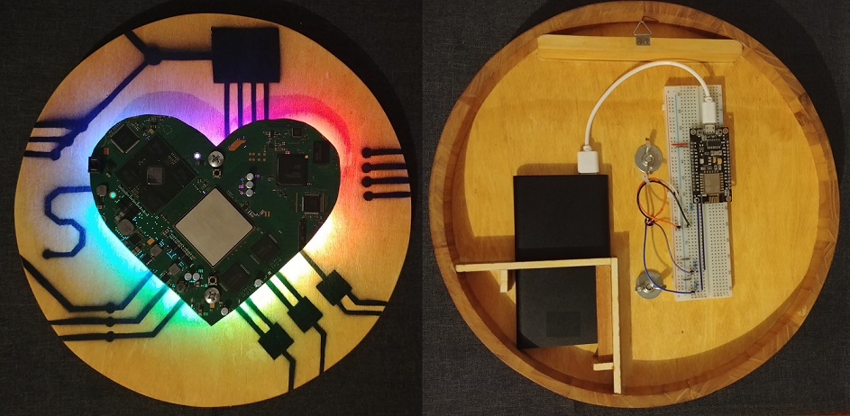
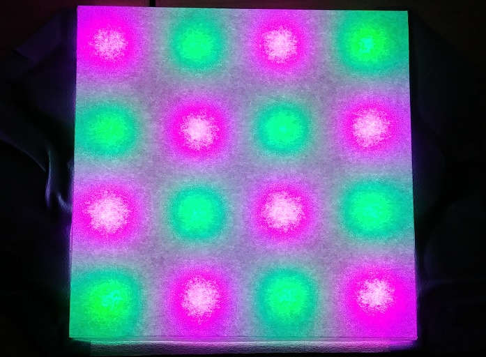
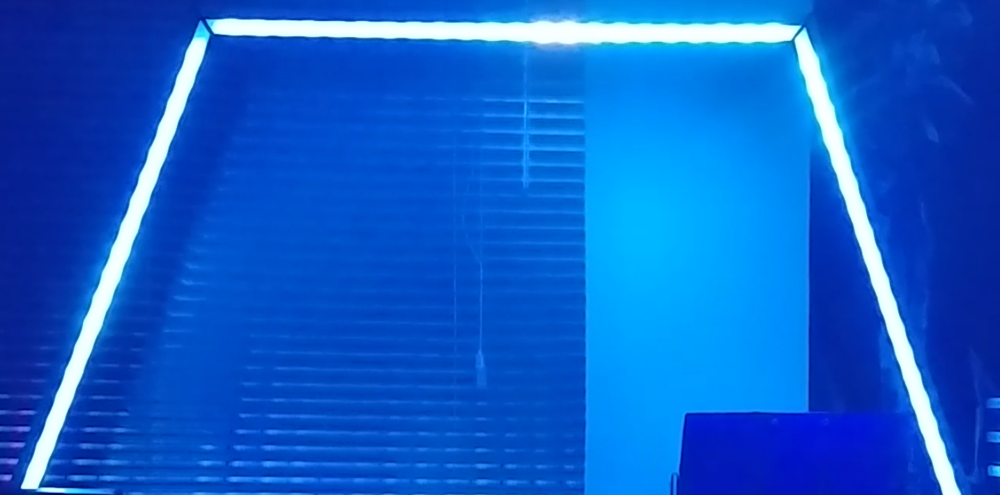
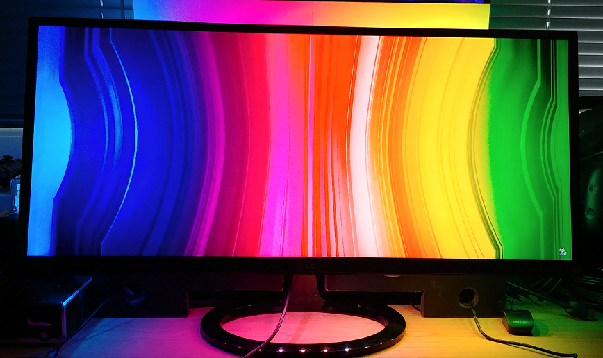
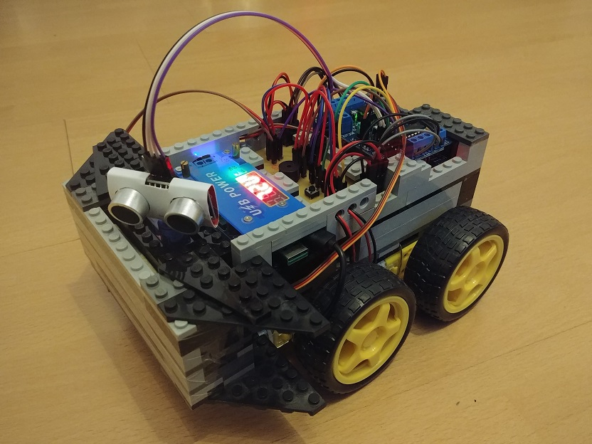

# Arduino Projects
This repository contains various smaller arduino projects.  

## LED Arc
This folder contains the code for a LED table lamp. 
The LED Arc was a prototype and is the predecessor of the LED Trapezoid.

## LED Heart
This folder contains the code for a led heart with various light modes.

## LED Matrix
This folder contains the code for a small led matrix.

## LED Trapezoid
This folder contains the code for the LED Trapezoid, a LED table lamp with various light modes and the possibility to automatically adjust the ambient light according to the screen content of a PC. 
In this case AmbiBox or a similar software is needed.

## Monitor Backlight
This folder contains the code for a self made monitor ambient light with the possibility to automatically adjust the LEDs according to the screen content of a PC. 
Additional software like AmbiBox or a similar program is needed.

## Obstacle Avoiding Robot
This folder contains the code for my self made obstacle avoiding robot.

